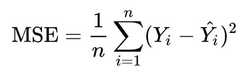

Demo video here: https://www.youtube.com/watch?v=RNiRpzP787M

This folder consist of two method: 

1. CNN based see in "CNNbased.py", in NAO writing project, we do not apply it to our struggled letter indentifing module, becuase it still in a low accuracy.

2. Mutil attributes based see in "main.py", "robot_write.py", and "ssim_similarity.py". 

    Inro of three file:

    2.1  "robot_write.py": this file only consit of a robot writing board. In this project, it will be pretended as a auto robot writing area.

    2.2  "main.py": this file allow children type the letter they wanna practice and a area to write the letter. It also provide a button called "if a good writing" to generate the feedback for child writing.

    2.3  "ssim_similarity.py": this is the main function of how to rate the hand writing and it consists of OCR , MSE, SSIM, Hamming Distance to measure the handwriting. 

   OCR (Optical Character Recognition): 
Optical Character Recognition (OCR) is a technology that is used to convert printed or handwritten text into machine-encoded text. The primary purpose of OCR is to recognize and digitize text from physical documents, such as scanned paper documents, images, or even text in natural scenes, making it accessible for digital storage, editing, and analysis.

   MSE (Mean Squared Error):
It is a common metric used in statistics, machine learning, and image processing to measure the average squared difference between the values predicted by a model or system and the actual observed values. MSE is often used as a measure of the quality of a predictive model or as a cost function to be minimized during the training of machine learning algorithms.
   

   SSIM (Structural Similarity Index):
It is a widely used image quality assessment metric that quantifies the structural similarity between two images. SSIM is designed to capture perceived changes in structural information, luminance, and contrast, making it a valuable tool for comparing the visual quality of images.

   

   Hamming Distance:
Hamming Distance is a metric used to measure the difference between two equal-length binary strings or sequences. It calculates the minimum number of substitutions required to change one string into the other. Hamming Distance is often used in information theory, coding theory, error correction, and digital communications.

   

   Overall method of measure handwriting:
   
   weight sequence = [ ["OCR", Ture or False (0 or 1)] , ["MSE", float from 0 to 1] , ["SSIM", float from 0 to 1] , ["Hamming Distance", float from 0 to 1] ]
   
   Overall = weight[OCR] x OCR - weight[MSE] x MSE + weight[SSIM] x SSIM - weight[Hamming Distance] x Hamming Distance + weight[fastdtw]fastdtw

   NOTE: the number of these three attributes has been nomalised into range[0,1]
         the weight for three attribute can be adjust manually, if you want, but you also need to adjust the hurdel of struggled letter.
            

python3 /home/shen/letter/NA-Redback/robot_write.py
python3 /home/shen/letter/NA-Redback/main.py
