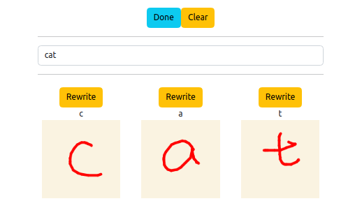

# NA-RedBack


- [NA-RedBack](#na-redback)
  - [Project Overview](#project-overview)
  - [Stakeholders](#stakeholders)
  - [Client Goals](#client-goals)
  - [Usage](#usage)
  - [Project Launch Steps](#project-launch-steps)
    - [configuration environment -ROS2 and Python](#configuration-environment--ros2-and-python)
      - [Setup Python 3.10](#setup-python-310)
      - [Setup Python 2.7](#setup-python-27)
      - [Setup ROS2 Humble](#setup-ros2-humble)
      - [Setup Docker](#setup-docker)
      - [Setup NA-RedBack Repository](#setup-na-redback-repository)
    - [Launch Naoqi Controller](#launch-naoqi-controller)
    - [Launch ROS2 Nodes](#launch-ros2-nodes)
      - [Launch Naoqi Controller](#launch-naoqi-controller-1)
    - [OpenAI key setup](#openai-key-setup)
    - [Choregraphe installation guidence](#choregraphe-installation-guidence)
    - [Use the drawing board](#use-the-drawing-board)
    - [Audio input, conversation with robot and collection of words guidance](#audio-input-conversation-with-robot-and-collection-of-words-guidance)
  - [Code Version](#code-version)
  - [Changelog](#changelog)
    - [Sprint 1  - 2023-03-24](#sprint-1----2023-03-24)
      - [Added](#added)
      - [Fixed](#fixed)
    - [Sprint 2  - 2023-05-01 -Video Demo](#sprint-2----2023-05-01--video-demo)
      - [Added](#added-1)
      - [Changed](#changed)
      - [Fixed](#fixed-1)
      - [Removed](#removed)
    - [Sprint 3  - 2023-05-26](#sprint-3----2023-05-26)
      - [Added](#added-2)
      - [Fixed](#fixed-2)
      - [Changed](#changed-1)
    - [Sprint 4  - 2023-06-09 -Demonstration Video](#sprint-4----2023-06-09--demonstration-video)
      - [Added](#added-3)
      - [Changed](#changed-2)
  - [Repository structure](#repository-structure)


## Project Overview

The project has two main objectives. Firstly, to develop a ROS module that enable NAO robot use ChatGPT in a versatile manner for different conversation contexts. Secondly, to create educational writing activity based on the existing CoWriter project, which involves the user teaching the robot how to write using the robot how to write using their demonstration to improve.

Our product is a unique and interactive learning tool that designed to help improve the handwriting specifically for children. The CoWriter robot will help child to improve their handwriting skills through teaching the robot the correct way to write. The CoWriter robot is setted to be a bad writer at first, which encourage the child to play the role of a teacher and guide the robot to improve its writing.

Through a step by step process, the child will teach the robot to write letters, numbers and finally full words. The gradual progression not only enhance the robot's handwriting but also allows the child to refine their own handwriting as well.

We call this process Learning by Teaching since it enables children to reinfornce their understanding of proper handwriting techniques while simultaneously helping the CoWriter to write in a beautiful way. 

Please review the following Development Environments such as [Confluence](https://confluence.cis.unimelb.edu.au:8443/x/3oKNBw) and [Trello link sprint1](https://trello.com/invite/b/lBVbLBjj/ATTId270c198df3df8e6019773576f136d3688780042/sprint1),[Trello link sprint2](https://trello.com/invite/b/0BSXP1S6/ATTI2f7d11233c6ad5b060c2b89b06f2b077C37A1A1F/sprint2ATTId270c198df3df8e6019773576f136d3688780042/sprint1), [Trello link sprint3](https://trello.com/invite/b/lok5Xccb/ATTI4255911dbf1eb229ac5b9aed68c3d0acDAA72C82/sprint3) and [Trello link sprint4](https://trello.com/invite/b/84x4mp8c/ATTIfa39864413f2e735454ecf3c6e55cbadB4161EB1/sprint4)


## Stakeholders

|  Name   | Title  | Contact Email | 
|  ----  | ----  | ----  |
| Wafa Johal  | Client | wafa.johal@unimelb.edu.au |
| Max Plumley | Supervisor |max.plumley@unimelb.edu.au |
| Eduardo Oliveira | Instructor |eduardo.oliveira@unimelb.edu.au|
| Chengfeng Zhang  | Product Owner | Chengfengz@student.unimelb.edu.au |
| Da Zhang	 | Scrum Master	 |dzzha1@student.unimelb.edu.au |
| Yuhang Wang	 | Team Developer |yuhang3@student.unimelb.edu.au|
| Minyi Chen	 | Backend developer |minyic@student.unimelb.edu.au|
| Sijia Pei		 | Team Developer |sipei@student.unimelb.edu.au|


## Client Goals
The project has been divided into 3 Work Packages(WP) as following:

* WP1: Update CoWriter project with python 3 and ROS version compatible with NAO v6  
  * An update version of Python(from py2 to py3) and ROS (from ROS1 to ROS2) for [cowriter_letter_learning](https://github.com/CHRI-Lab/cowriter_letter_learning/tree/thibault)
  * An update version of Python(from py2 to py3) for [shape_learning](https://github.com/chili-epfl/shape_learning)
  * A new drawing board serves as a tool for drawing letters
  * A communication function for transmitting information is established between the drawing board and ros2

* WP2: Integrate ChatGPT with the NAO robot for autonomous dialogue, personalised selection of words, and autonomous robot motion during conversation
  * An update for a better display of the drawing board
  * A chatgpt voice dialogue function that allows Nao robots to use chatgpt personalized vocabulary selection to communicate with users
  * Autonomous robot motion during conversation（To be developed）
* WP3: (optional) Implement a logging and annotation module using the ROS4HRI package

 WP1 and WP2 have been completed according to the client's requirements. WP3 is classified as a future development plan.


## Usage
The usage of the repository can be accessed [cowriter_letter_learning](https://github.com/CHRI-Lab/cowriter_letter_learning/tree/thibault) and [shape_learning](https://github.com/chili-epfl/shape_learning)


## Project Launch Steps

### configuration environment -ROS2 and Python

#### Setup Python 3.10

  **Windonws** 
  1. Visit the official Python website's [download page](https://www.python.org/downloads/) Download the Windows installer for Python 3.10 by clicking on the appropriate link (either 32-bit or 64-bit, depending on your system). 
  2. Run the installer and follow the on-screen instructions.
  3. Make sure to check the box that says `Add Python 3.10 to PATH` during installation. This will make it easier to run Python from the command line.
  4. Complete the installation process.

  **macOS**
  1. Visit the official Python website's [download page](https://www.python.org/downloads/) Download the macOS installer for Python 3.10.
  2. Open the downloaded package and follow the on-screen instructions to complete the installation process.
   
  **Linux (Ubuntu, Debian)** 

  Python 3.10 may not be available in the default repositories for some Linux distributions. In that case, you can use the "deadsnakes" PPA repository to install it. Run the following commands in the terminal:
  ```
  sudo apt update

  sudo apt install software-properties-common

  sudo add-apt-repository ppa:deadsnakes/ppa

  sudo apt update

  sudo apt install python3.10
  ```
  After completing the installation, you can check the Python version by running `python3.10 --version` in the command line or terminal.

#### Setup Python 2.7

  **Windonws** 
  1. Visit the official Python website's [download page](https://www.python.org/download/releases/2.7/) Download the Windows installer for Python 2.7 by clicking on the appropriate link (either Windows x86 or Windows x86-64, depending on your system). 
  2. Run the installer and follow the on-screen instructions.
  3. Make sure to check the box that says `Add Python 2.7 to PATH` during installation. This will make it easier to run Python from the command line.
  4. Complete the installation process.

  **macOS**
  1. Visit the official Python website's [download page](https://www.python.org/download/releases/2.7/) Download the macOS installer for Python 2.7.
  2. Open the downloaded package and follow the on-screen instructions to complete the installation process.
   
  **Linux (Ubuntu, Debian)** 

  Python 2.7 may not be available in the default repositories for some Linux distributions. In that case, you can use the "deadsnakes" PPA repository to install it. Run the following commands in the terminal:
  ```
  sudo apt update
  sudo apt install python2
  ```
  After completing the installation, you can check the Python version by running `python --version` in the command line or terminal.


#### Setup ROS2 Humble

**Ubuntu Linux**

```
sudo apt update sudo apt upgrade

sudo locale-gen en_US en_US.UTF-8 sudo update-locale LC_ALL=en_US.UTF-8 LANG=en_US.UTF-8 export LANG=en_US.UTF-8

sudo apt install curl gnupg2 lsb-release curl -s https://raw.githubusercontent.com/ros/rosdistro/master/ros.asc | sudo apt-key add -

sudo sh -c 'echo "deb [arch=$(dpkg --print-architecture) signed-by=/usr/share/keyrings/ros-archive-keyring.gpg] http://packages.ros.org/ros2/ubuntu $(lsb_release -cs) main" > /etc/apt/sources.list.d/ros2.list'

sudo apt update

sudo apt install ros-humble-desktop

echo "source /opt/ros/humble/setup.bash" >> ~/.bashrc source ~/.bashrc
```
**macOS and Windows**

ROS2 is primarily targeted at Ubuntu Linux, but there are experimental installations available for macOS and Windows. The official ROS2 installation documentation provides instructions for these platforms, but keep in mind that support may be limited, and not all features and packages may be available. For the most up-to-date instructions, refer to the official ROS2 documentation: [macOS](https://index.ros.org/doc/ros2/Installation/OSX-Development-Setup/) and [Windows](https://index.ros.org/doc/ros2/Installation/Windows-Development-Setup/)

Remember to always check the official ROS2 documentation for the most accurate and up-to-date installation instructions.

#### Setup Docker

**Ubtuntu**

```
sudo apt-get update
sudo apt-get install docker-ce docker-ce-cli containerd.io docker-buildx-plugin docker-compose-plugin
```

**macOS**

```
sudo yum install docker-ce docker-ce-cli containerd.io docker-buildx-plugin docker-compose-plugin

sudo systemctl start docker
```

**Windows**
Please follow the [installation manual](https://docs.docker.com/desktop/install/windows-install/) to install the desktop version of Docker

#### Setup NA-RedBack Repository

1. Set Git username information
```
git config --global user.name  "github’s Name"
git config --global user.email  "github@xx.com"
```
2. Configure ssh key

``` 
ssh-keygen -t rsa -C "github@xx.com"
cd .ssh
```
Enter `Github`, in `Your Profile`, click on `SSH Keys` on the left, and then click on the `Add SSH key` button on the right

Among them, fill in the `title` casually,copy the content from `id_rsa.pub` to `Key`, click the `Add Key` button below, and then enter the following command on the command line to check if the configuration is successful:
```
ssh -T git@github
```
If the welcome statement is returned, the configuration is successful. If it fails, please check the previous operation process for any errors

3. Clone Repository
```
git clone git@github.com:COMP90082-2023-SM1/NA-RedBack.git

```

4. Use Docker to build project
   
```
cd NA-RedBack/src/nao_drawing_board/
docker compose -f docker-compose.dev.yml up --build
```
**Note that each time a new repository is installed, a new build is required, or you may install Node.js and run the dev server locally**

5. You may now visit the web applications with the address of the dev server

### Launch Naoqi Controller
Since the naoqi SDK is written in python 2.7, you may only import it with python 2.7.
1. Prepare python 2.7 venv
2. Get the ip address and port number of the Nao Robot and edit the code
3. Run the file `tests/Naoqi2robot/nao_bot_controller.py`
Now the robot should be connected and ready to accept input from the drawing board and the chatbox.

### Launch ROS2 Nodes
1. Navigate to the folder `src/nao_ros2_ws`
2. Build the project with command `colcon build`
3. Source the project with command `source install/setup.bash`
4. Run the launch file with `ros2 launch launch/nao_writing_launch.py`
Now, four nodes will be launched, which are `input_interpreter, learning_word, nao_writer_naoqi, audio_chat`
You should also notice a chat box also pops up on the screen.

#### Launch Naoqi Controller
Since the naoqi SDK is written in python 2.7, you may only import it with python 2.7.
1. Prepare python 2.7 venv
2. Get the ip address and port number of the Nao Robot and edit the code
3. Run the file `tests/Naoqi2robot/nao_bot_controller.py`
Now the robot should be connected and ready to accept input from the drawing board and the chatbox.

### OpenAI key setup

Since this project incorporates chatGPT, an openAI key needs to be set up to invoke the GPT model. Here are the steps to set up openAI key:

1. Create an OpenAI account. Visit the OpenAI [website](https://www.openai.com/) and follow the instructions to create a new account.

2. Log into the [website](https://platform.openai.com/account/billing/overview) to set up billing information for using OpenAI API.
 
3. Log into the [API keys website](https://platform.openai.com/account/api-keys) to create new secret key.

4. When the key is created, copy and paste it to save it. The complete key may only appear once.

5. In the project folder, nevigate to: `src/nao_ros2_ws/src/nao_writing/nao_writing/audio_chat.py`, replace the value of the global variable: `api_key` in the `audio_chat.py` file with the key you just obtained in step3


### Choregraphe installation guidence

Choregraphe is a software for programming and monitoring SoftBank Robotics' Nao and Pepper robots. Here are the steps on how to install and launch Choregraphe on Linux and Windows systems.

**Linux:**

1. Go to SoftBank Robotics' official website and download the Choregraphe suite for Linux systems.

2. Open your Linux terminal.

3. Navigate to the folder containing the `.tar.gz` file you downloaded. You can do this using the `cd` command.

4. Extract the downloaded `.tar.gz` file using the `tar -xvzf [filename].tar.gz` command.

5. Navigate into the extracted directory using the `cd` command.

6. To start Choregraphe, you can run the choregraphe script in the bin folder. The command would be `./bin/choregraphe`.

**Windows:**

1. Go to SoftBank Robotics' official website and download the Choregraphe suite for Windows systems.

2. After downloading the `.exe` file, navigate to the download location.

3. Double-click on the `.exe` file to launch the installer.

4. Follow the instructions provided by the installer.

5. Once installed, you should be able to launch Choregraphe either from the Start menu or the desktop shortcut if you chose to create one during installation.


**To switch robot model:**

Navigate to the "View" tab, find and select the "Robot View" option, then navigate to the top-right corner. You should see a drop-down menu where you can select the robot model you want to use.

### Use the drawing board
The drawing board consisted of two button and one input box, the two buttons are 'Done', 'Clear'.
'Done' button will send the drawing strokes to backend and 'Clear' button will clear all inputs.
1. Input the word you want to write in the input box, you should see eqaul numbers of canvas being created for each char
2. Draw each char as suggested by the char on top of each canvas, you may use the 'Rewrite' button to clear the corresponding canvas
4. Click 'Done' to send the drawings to backend <br>


### Audio input, conversation with robot and collection of words guidance

The process for users to input with their own microphone is as follows:

1. The user first clicks on "record". There might be some warnings in the terminal after clicking, but it won't affect the process (this might be due to issues between the Ubuntu virtual environment and the Windows audio device).

2. After seeing the warning, the user starts to speak. When finished, the user waits for a second or two.

3. The "stop" button will light up, indicating that the parsing of user input is complete. The user clicks "stop", and the parsed user input will appear in the prompt box. Sometimes the parsing might not be accurate, in which case the user can manually modify the input.

4. The user clicks "submit" to submit the question and wait for the reply.

The implementation logic of "collection of words" is almost the same as a regular chat. The user mentions a topic of interest, and then ChatGPT returns 5 related words for the user to choose and practice. However, the difference is that, whether the user types in the input or speaks it, the phrase "let's practice" or "let's practise" must appear in the user's input. Only then will the program enter the "collection of words" mode. An example of collection of words user input request: Hi, I'm interested in space. **Let's practice** some english words about space!


## Code Version

* Python 3.10([Python 3.10 download link](https://www.python.org/downloads/release/python-390/)) The version used in the [src](https://github.com/COMP90082-2023-SM1/NA-RedBack/tree/main/src) section of this project is py3.9
* Python 2.7 ([Python 2.7 download link](https://www.python.org/download/releases/2.7/) The version used in the [tests](https://github.com/COMP90082-2023-SM1/NA-RedBack/tree/main/tests) section of this project is py2.7
* Ubuntu 22.04 ([Ubuntu 22.04 download link](https://ubuntu.com/)))
* ROS2 humble ([ROS2 humble installation for Ubuntu](https://docs.ros.org/en/foxy/Installation/Ubuntu-Install-Debians.html)) 
**For specific usage of ROS, please refer to [Operation method of ROS2](https://docs.ros.org/en/foxy/Tutorials.html)** 
* Docker **5:24.0.1-1~ubuntu.22.04~jammy** ([Docker installation for Ubuntu](https://docs.docker.com/engine/install/ubuntu/) ) 


## Changelog

### [Sprint 1 ] - 2023-03-24

#### Added

- [Sijia](https://github.com/COMP90082-2023-SM1/NA-RedBack/tree/Sijia) 
  * The project structure is established 
  * The letter-learning-interaction folder created 
  * The update of Python code in the cowriter has been basically completed 


#### Fixed

- [Sijia](https://github.com/COMP90082-2023-SM1/NA-RedBack/tree/Sijia) 
  * The project structure has been updated and supplemented completely 


### [Sprint 2 ] - 2023-05-01 -[Video Demo](https://www.youtube.com/watch?v=3e0Nvp-He80)

#### Added

- [Sijia-shape_learning](https://github.com/COMP90082-2023-SM1/NA-RedBack/tree/Sijia-shape_learning) 
  * Shape_ Learning library updated from Python 2 to Python 3 
  

- [Yuhang_cowriter_letter_learning](https://github.com/COMP90082-2023-SM1/NA-RedBack/tree/Yuhang_cowriter_letter_learning) 
  * Cowriter_letter_learning repo(exclude the launch package) updated from ROS 1 to ROS2 Humble 

 
- [naoqi2robot](https://github.com/COMP90082-2023-SM1/NA-RedBack/tree/naoqi2robot)
  * The virtual robot in choregraphe realizes arm rotation and movement by using naoqi SDK in python2.7 environment 

- [minyi](https://github.com/COMP90082-2023-SM1/NA-RedBack/tree/minyi) 
  * The important content in Cowriter_ letter_ Learning and Shape_learning is extracted and integrated, and some of it is fixed 
  * Implement a simple flask backend to precoess Http request 
  * A drawing board function has been added 
  * The communication function between the drawing board and ros2 has been completed 

- [main](https://github.com/COMP90082-2023-SM1/NA-RedBack)
  * Added a service for node to request the shape learning alogorithm in nao_ros2_ws/src 


#### Changed
[main](https://github.com/COMP90082-2023-SM1/NA-RedBack)
  * Update Sprint1 changelog  to be accurate

#### Fixed

- [Yuhang_cowriter_letter_learning](https://github.com/COMP90082-2023-SM1/NA-RedBack/tree/Yuhang_cowriter_letter_learning) 
  * Bugs of nodes, configuration for nodes, import errors are fixed 

- [Sijia-shape_learning](https://github.com/COMP90082-2023-SM1/NA-RedBack/tree/Sijia-shape_learning) 
  * Solving  Parameter bugs and graphic adjustment bugs in the shape_learning library 
  

#### Removed

- [main](https://github.com/COMP90082-2023-SM1/NA-RedBack)
  * The letter-learning-interaction folder has been deleted 


### [Sprint 3 ] - 2023-05-26

#### Added
[naoqi2robot](https://github.com/COMP90082-2023-SM1/NA-RedBack/tree/naoqi2robot)
 * Added chatgpt voice dialogue function, allowing robots to autonomously select words to communicate with users

[Nao_writing](https://github.com/COMP90082-2023-SM1/NA-RedBack/tree/Sijia-Nao_writing)
  * Add a method for Nao robot arm movement and a communication function

[robot_controller](https://github.com/COMP90082-2023-SM1/NA-RedBack/tree/robot_controller)
  * Add integrated robot communication function, the robot can receive the output of the drawing board and learn to write
  * Add robot voice output function
  
[nao_ros2_ws](https://github.com/COMP90082-2023-SM1/NA-RedBack/tree/nao_ros2_ws)
  * Add launch file
  * Add chatgpt voice input function to the ROS framework

#### Fixed

[nao_drawing_board](https://github.com/COMP90082-2023-SM1/NA-RedBack/tree/nao_drawing_board)
  * Fix bugs on the drawing board
  
[nao_ros2_ws](https://github.com/COMP90082-2023-SM1/NA-RedBack/tree/nao_ros2_ws)
  * Fix bugs on the ros2

#### Changed
[main](https://github.com/COMP90082-2023-SM1/NA-RedBack)
  * Update COMP900822023SM1NARedBack_sprint2-confluence.pdf files containing garbled code to be accurate


### [Sprint 4 ] - 2023-06-09 -[Demonstration Video](https://youtu.be/fyKoKvxCB0M)
#### Added
[main](https://github.com/COMP90082-2023-SM1/NA-RedBack)
  * Add Project `Launch Steps section` to `readme.md` and `prototypes\Project_Launch_Steps.md`
  * Add Project `data sample`
  
#### Changed
[main](https://github.com/COMP90082-2023-SM1/NA-RedBack)
  * Update Sprint2 and Sprint3 changelog to be accurate

[Sprint 1]: https://github.com/COMP90082-2023-SM1/NA-RedBack/tree/COMP90082_2023_SM1_NA_RedBack_BL_SPRINT1
[Sprint 2]: https://github.com/COMP90082-2023-SM1/NA-RedBack/tree/COMP90082_2023_SM1_NA_RedBack_BL_SPRINT2
[Sprint 3]: https://github.com/COMP90082-2023-SM1/NA-RedBack/tree/COMP90082_2023_SM1_NA_RedBack_BL_SPRINT3
[Sprint 4]: https://github.com/COMP90082-2023-SM1/NA-RedBack/tree/COMP90082_2023_SM1_NA_RedBack_BL_SPRINT4

## Repository structure  

```
NA-RedBack
├─ .gitignore
├─ data sample
│  ├─ collection of words
│  │  ├─ output_data_sample.jpg
│  │  └─ user_input_data_sample.jpg
│  ├─ conversation
│  │  ├─ output_data_sample.jpg
│  │  └─ user_input_data_sample.jpg
│  ├─ drawing board
│  │  ├─ input_box_data_sample.png
│  │  ├─ one_letter_data_sample.png
│  │  ├─ three_letters_data_sample.png
│  │  ├─ two_letters_data_sample.png
│  │  ├─ write_cat_data_sample.png
│  │  ├─ write_ca_data_sample.png
│  │  └─ write_c_data_sample.png
│  └─ letter_shape data sample
├─ docs
│  ├─ COMP900822023SM1NARedBack_sprint1-confluence.pdf
│  ├─ COMP900822023SM1NARedBack_sprint2-confluence.pdf
│  ├─ COMP900822023SM1NARedBack_sprint3-confluence.pdf
│  ├─ COMP900822023SM1NARedBack_sprint4-confluence.pdf
│  ├─ Sprint1_checklist.md
│  ├─ Sprint2_checklist.md
│  ├─ Sprint3_checklist.md
│  └─ Sprint4_checklist.md
├─ prototypes
│  ├─ images
│  │  └─ drawing_board.png
│  └─ Project_Launch_Steps.md
├─ README.md
├─ src
│  ├─ nao_drawing_board
│  │  ├─ .dockerignore
│  │  ├─ .eslintrc.cjs
│  │  ├─ .gitignore
│  │  ├─ docker-compose.dev.yml
│  │  ├─ docker-compose.yml
│  │  ├─ Dockerfile
│  │  ├─ index.html
│  │  ├─ nginx.conf
│  │  ├─ package.json
│  │  ├─ public
│  │  │  └─ vite.svg
│  │  ├─ src
│  │  │  ├─ App.css
│  │  │  ├─ App.tsx
│  │  │  ├─ assets
│  │  │  │  └─ react.svg
│  │  │  ├─ components
│  │  │  │  ├─ Canvas.tsx
│  │  │  │  ├─ CanvasManager.tsx
│  │  │  │  └─ css
│  │  │  │     ├─ canvas.css
│  │  │  │     └─ canvas_manager.css
│  │  │  ├─ index.css
│  │  │  ├─ main.tsx
│  │  │  ├─ types
│  │  │  │  └─ types.ts
│  │  │  └─ vite-env.d.ts
│  │  ├─ tsconfig.json
│  │  ├─ tsconfig.node.json
│  │  └─ vite.config.ts
│  ├─ nao_ros2_ws
│  │  ├─ launch
│  │  │  └─ nao_writing_launch.py
│  │  └─ src
│  │     ├─ interface
│  │     │  ├─ CMakeLists.txt
│  │     │  ├─ msg
│  │     │  │  ├─ Shape.msg
│  │     │  │  ├─ Shapes.msg
│  │     │  │  ├─ Stroke.msg
│  │     │  │  └─ Strokes.msg
│  │     │  ├─ package.xml
│  │     │  └─ srv
│  │     │     ├─ GetDemo.srv
│  │     │     └─ LearnShape.srv
│  │     └─ nao_writing
│  │        ├─ nao_writing
│  │        │  ├─ audio_chat.py
│  │        │  ├─ input_interpreter.py
│  │        │  ├─ learning_word.py
│  │        │  ├─ letter_model_datasets
│  │        │  ├─ nao_writer_naoqi.py
│  │        │  ├─ shape_learner.py
│  │        │  ├─ shape_learner_manager.py
│  │        │  ├─ shape_modeler.py
│  │        │  └─ __init__.py
│  │        ├─ package.xml
│  │        ├─ resource
│  │        │  └─ nao_writing
│  │        ├─ setup.cfg
│  │        ├─ setup.py
│  │        ├─ test
│  │        │  ├─ test_copyright.py
│  │        │  ├─ test_flake8.py
│  │        │  └─ test_pep257.py
│  │        └─ __init__.py
│  └─ __init__.py
└─ tests
   └─ Naoqi2robot
      ├─ nao_bot_controller.py
      ├─ readme.md
      ├─ robot_controller.py
      └─ TestRobot.py

```
