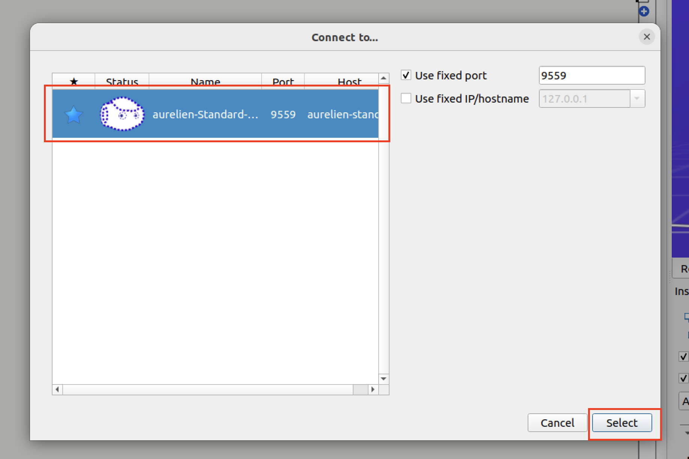
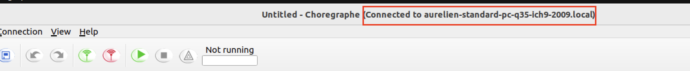

# Installation Guide

This section gathers all the installations and commands needed to launch the project. Hence, the pages must be consulted in the same order as they appear in Confluence's tree structure:
- Ubuntu
- Choregraphe
- Docker

to finally be able to run all the commands of Launch the Project section. 

## Ubuntu

To run the software that enable communication with the NAO robot (Choregraphe), developers need to install a version of Ubuntu (20.04 or 22.04) on their laptop.

### For Windows users

A dual boot (complete installation of the Linux OS) might be the best option because virtual machines can be really slow, in particular when Choregraphe is running.

### For Mac users

First determine the computer's architecture by running the uname -a command in a terminal. Now there are two options:

if the architecture is amd64 / x86 (mostly old models of Macs), then it is compatible with Chroregraphe's required architecture. You should be able to install the desired version of Ubuntu using BootCamp
if the architecture is arm64 (new versions of Macs, using M1 or M2 chips), then it is not compatible with the required architecture.
Solutions for arm64 based Macs:
- VirtualBox, Parallels ... do not offer the possibility to emulate an amd64 architecture on arm64 based Macs, UTM does. But when Choregraphe and the programs are running, the virtual machine becomes really slow and laggy
- We also tried to only run Choregraphe in UTM and the code on the host. Choregraphe's robot port can be forwarded to the host and Docker Desktop offers the possibility to run amd64 based containers on arm64 architecture, but we never succeeded to reach that exposed port from the code running in a container
- Finally, we also considered to use GoogleCloudPlatform to host the amd64 based VM (tutorial here): by selecting the right amount of CPUs (at least 4), the result was more smooth compared to UTM. The only downside hosting the development environment on GCP is that we cannot connect to the real robot, the IP is unreachable from the VM. Moreover, running the VM generate costs (but usually, GCP offers some free credits to their new users that are sufficient to cover these costs).

In the end, UTM seems to be the unique viable solution if the tests have to be run with the real robot. If the simulated robot is enough, running the code on a GCP VM is a better (but costly) option.

If the developer only requires to do some code development or debugging that does not require any interaction with the robot (real or simulated), using Docker containers as a development environment can be enough.

## Choregraphe

In order to communicate with the NAO robot, a software called Choregraphe has to be installed. It has two purposes:

launch a robot simulation, to run code even if the physical robot is not available
establish the communication with a real Nao robot.
Even if the installation page of Choregraphe offers installation files for Windows, Mac and Linux, but we recommend to use the Linux version.

### Installation on Ubuntu
Download the setup file from this [link](https://community-static.aldebaran.com/resources/2.8.6/choregraphe-suite-2.8.6.23-linux64-setup.run).

Change the file permissions and execute it:
```bash
chmod +x choregraphe-suite-2.8.6.23-linux64-setup.run
sudo ./choregraphe-suite-2.8.6.23-linux64-setup.run
```

Try to run: `"/opt/Softbank Robotics/Choregraphe Suite 2.8/bin/choregraphe_launcher"`. In case of an error:
```bash
# error
/opt/Softbank Robotics/Choregraphe Suite 2.8/bin/../lib/../lib/../lib/libz.so.1:
version `ZLIB_1.2.9' not found (required by /usr/lib/x86_64-linux-gnu/libpng16.so.16)
```

Run the following commands:
```bash
cd "/opt/Softbank Robotics/Choregraphe Suite 2.8/lib/"
sudo mv libz.so.1 libz.so.1.old
sudo ln -s /lib/x86_64-linux-gnu/libz.so.1
```

Command specified in 3 should work, it will launch the application. It is also possible to launch Choregraphe by clicking directly on the application shortcut.

## Docker

To install Docker, run the following instructions in your Ubuntu instance.

Uninstall all conflicting packages
```bash
for pkg in docker.io docker-doc docker-compose podman-docker containerd runc; do sudo apt-get remove $pkg; done
```

Add Docker's repository to your Apt repository
```bash
# Add Docker's official GPG key:
sudo apt-get update
sudo apt-get install ca-certificates curl gnupg
sudo install -m 0755 -d /etc/apt/keyrings
curl -fsSL https://download.docker.com/linux/ubuntu/gpg | sudo gpg --dearmor -o /etc/apt/keyrings/docker.gpg
sudo chmod a+r /etc/apt/keyrings/docker.gpg
 
# Add the repository to Apt sources:
echo \
  "deb [arch="$(dpkg --print-architecture)" signed-by=/etc/apt/keyrings/docker.gpg] https://download.docker.com/linux/ubuntu \
  "$(. /etc/os-release && echo "$VERSION_CODENAME")" stable" | \
  sudo tee /etc/apt/sources.list.d/docker.list > /dev/null
sudo apt-get update
```

Install Docker packages
```bash
sudo apt-get install docker-ce docker-ce-cli containerd.io docker-buildx-plugin docker-compose-plugin
```

Check if the installation is successful
```bash
sudo docker run hello-world
```
(Docker's installation guide for Linux is available [here](https://docs.docker.com/engine/install/ubuntu/))

### Post-installation steps
After installing Docker, we recommend to execute the following commands:
```bash
sudo groupadd docker
sudo usermod -aG docker $USER
```
This will enable the current user to use Docker commands without calling sudo . To be effective, the user should restart his Ubuntu instance first.

In case the following error appears when executing a Docker command,
```bash
Cannot connect to the Docker daemon at unix:///var/run/docker.sock. Is the docker daemon running?.
See 'docker run --help'.
```
it means that Docker is not running. The service has to be started manually:

```bash
sudo systemctl start docker
```

## Launch the Project (Production)
*This page will be updated during the project. Since it gathers all the instructions required to launch our source code, it is meant to be modified.*

This section presents the steps required to launch the project in a production environment (final product). To launch a development environment see the next section.

To run the project, run the following commands in the same order they appear:

Clone the repository:
```bash
git clone git@github.com:COMP90082-2023-SM2/NA-Redback.git
cd NA-Redback
```

Check if the "make" command is available by running:
```bash
which make
# if the output is "/usr/bin/make", then skip the following commands
# if not, run
sudo apt-get update
sudo apt-get install -y make
```

Set the ENV variable to "production":
```bash
export ENV=production
```

Build the Docker images:
```bash
make compose-build
```
Note: once the images are built, you do not need to execute this step again unless you modify the environment (ex: installation of a new Python module) or the source code (new commit).

Launch Choregraphe and start the virtual robot:

Once Choregraphe is opened, click on Connection > Connect to... Select the robot by clinking on it, then press Select.
<p align="center">
  
</p>

After the initialisation, you should be able to see a similar message as the one below, meaning that the virtual robot is ready to be used.
<p align="center">
  
</p>

Prepare the `.env` file: an example is provided in the repository (see `.env.example`).


Launch the Docker containers:
```bash
make compose-up
```
That command will start the fronted application (React), the ROS nodes and the Flask API (link between React and ROS).

Open your browser and navigate to the following URL to access the React application: http://127.0.0.1 


## Launch the Development environment

Clone the repository:
```bash
git clone git@github.com:COMP90082-2023-SM2/NA-Redback.git
cd NA-Redback
```

Check if the "make" command is available by running:
```bash
which make
# if the output is "/usr/bin/make", then skip the following commands
# if not, run
sudo apt-get update
sudo apt-get install -y make
```

Set the ENV variable to "development":
```bash
export ENV=development
```

Build the development images:
```bash
make compose-build
```
Note: once the images are built, you do not need to execute this step again except if you change the environment (ex: installation of a new Python module).

Prepare the `.env` file: an example is provided in the repository (see `.env.example`).

Run (create) the containers:
```bash
make compose-up
```

To access the web application, open your browser and navigate to the following URL: http://localhost:3000.

If you want to change the environment, modify the Dockerfile accordingly then, rebuild the image and launch the containers.

### Develop in the environment

Once the containers have been created and are running, you can access the code inside it either by:
- opening a VSCode window using the Dev Container extension (guide on Confluence). When the window is opened, open a terminal (ctrl+J or cmd+J), then on the prompt type bash and press enter
- executing the container (eg. log inside it) by running in a terminal window:
```bash
# note: before executing this command, the container must already be running
docker exec -it <the-name-of-the-container> bash
```

### Test & Debug in the environment (ROS)
All the following commands are meant to be ran inside the container, eg. in the terminal window opened by either of the two possible options presented above

Since the source code of the project is only "linked" to the container, none of the ROS packages have been built. To test and debug the code, the packages need to be built then launched in the container.

Ensure that the ROS environment variables are loaded:
```bash
source /opt/ros/humble/setup.bash
which ros2
# the output should be "/opt/ros/humble/bin/ros2"
```

Navigate to the same level as the src folder to build the desired ROS packages:
```bash
sudo colcon build --packages-select <the-package-name>
```

Add the package's path to the environment variables:
```bash
source ./install/setup.bash
```

The nodes / package can now be tested:

- to run a single node, run:
```bash
ros2 run <the-package-name> <the-name-of-the-node>
```
- to run all the nodes at the same time (if the package contains a .launch.py file:
```bash
ros2 launch <the-package-name> <the-name-of-the-launch-file>
```

If you modify the source code of the package, rebuild it and run the node / the package again. If the package is not rebuilt, the changes will not be taken into account.

### Test & Debug in the environment (React)

Once the frontend container is running, the app will be updated each time a file is modified and saved. There is no need to relaunch the containers unless you add a new dependency.
