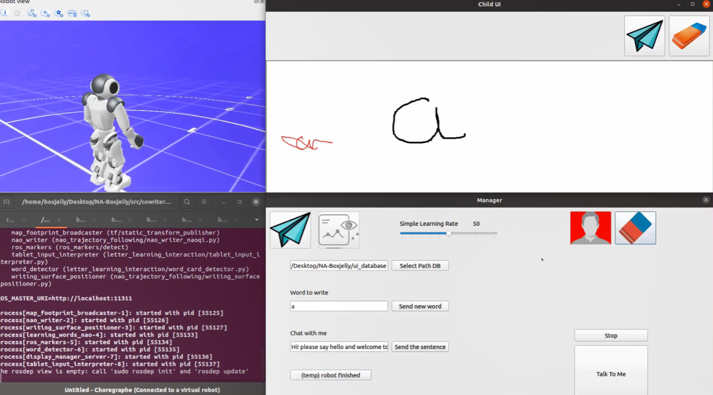

choose_adaptive_words
===========================

This package contains a set of nodes that are used to get user handwriting input, show robot output, and a interface for mananger to operate the robot

Tested with Python 3.8.10 and ROS Noetic on Ubuntu 20.04 (LTS).

Requierments:
---------------
See CoWriter project requirements

Provided functionalities:
---------------
In `./nodes` run `python activity.py`to launch the writing app. 
The main node that opens two windows, one for writing the other one to manage the parameters



TODO:
- Allow Change the Simple Learning Pace
- Process Multi-stroke letters and Multi-letter Words
- Interaction between Child Profile and Nao to generate personalized word suggestions
- Make a eraser, select the zones to clean
- check finish, instead of manual clicking

Usage
-----
```
# assume letterlearning_interaction is running
# launch demo backend
	# in terminal 1
	$ python3 src/choose_adaptive_words/nodes/temp_backend.py

# launch UI
	# in terminal 2
	$ python3 src/choose_adaptive_words/nodes/manager_ui.py
	# in terminal 3
	$ python3 src/choose_adaptive_words/nodes/child_ui.py
```
